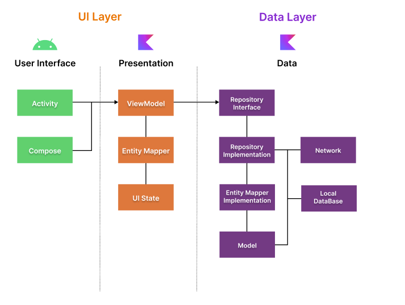
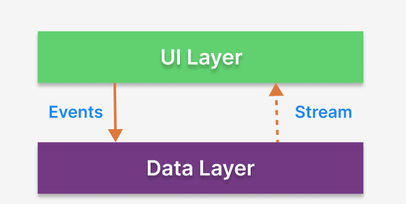
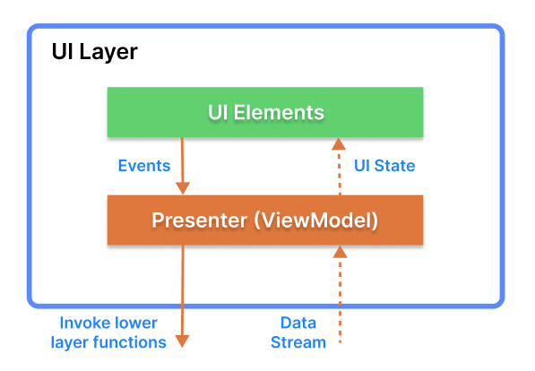
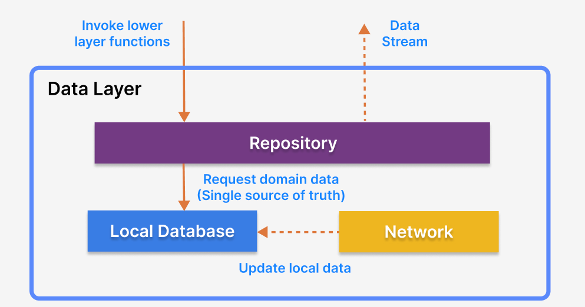

  

This is a login app built with Jetpack Compose

The purpose of this repository is to demonstrate below:

- Implementing entire UI elements with Jetpack Compose.
- Implementation of Android architecture components with Jetpack libraries such as Hilt.
- Performing background tasks with Kotlin Coroutines.

### Usage
- Valid users are in this json in the *login* field [Users](https://gist.githubusercontent.com/giovannyvelezalt/977222c95645fa89c36e7b35a2f84251/raw/da16b9d7f08a2ee129c4200a689b2362fd0d2b5c/)
- No password necessary in this app
- 

## 📷 Preview
- https://raw.githubusercontent.com/giovannyvelezalt/LoginApp/master/figures/login.webm.mov

## 🛠 Tech Stacks & Open Source Libraries
- Minimum SDK level 21.
- 100% [Jetpack Compose](https://developer.android.com/jetpack/compose) based + [Coroutines](https://github.com/Kotlin/kotlinx.coroutines) + [Flow](https://kotlin.github.io/kotlinx.coroutines/kotlinx-coroutines-core/kotlinx.coroutines.flow/) for asynchronous.
- Jetpack
  - Compose: Android’s modern toolkit for building native UI.
  - ViewModel: UI related data holder and lifecycle aware.
  - App Startup: Provides a straightforward, performant way to initialize components at application startup.
  - Navigation: For navigating screens and [Hilt Navigation Compose](https://developer.android.com/jetpack/compose/libraries#hilt) for injecting dependencies.
  - Room: Constructs Database by providing an abstraction layer over SQLite to allow fluent database access.
  - [Hilt](https://dagger.dev/hilt/): Dependency Injection.
- [accompanist](https://github.com/google/accompanist): A collection of extension libraries for Jetpack Compose
- [Retrofit2 & OkHttp3](https://github.com/square/retrofit): Construct the REST APIs and paging network data.
- [ksp](https://github.com/google/ksp): Kotlin Symbol Processing API.
- [Timber](https://github.com/JakeWharton/timber): A logger with a small, extensible API which provides utility.
- Baseline Profiles: To improve app performance by including a list of classes and methods specifications in your APK that can be used by Android Runtime.

## 🏛️ Architecture

This app follows the [Google's official architecture guidance](https://developer.android.com/topic/architecture).

This app was built with [Guide to app architecture](https://developer.android.com/topic/architecture), so it would be a great sample to show how the architecture works in real-world projects. 

The overall architecture is composed of two layers; UI Layer and the data layer. Each layer has dedicated components and they each have different responsibilities.
The arrow means the component has a dependency on the target component following its direction.

### Architecture Overview

Each layer has different responsibilities below. Basically, they follow [unidirectional event/data flow](https://developer.android.com/topic/architecture/ui-layer#udf).

### UI Layer

The UI Layer consists of UI elements like buttons, menus, tabs that could interact with users and [ViewModel](https://developer.android.com/topic/libraries/architecture/viewmodel) that holds app states and restores data when configuration changes.

### Data Layer

The data Layer consists of repositories, which include business logic, such as querying data from the local database and requesting remote data from the network. It is implemented as an offline-first source of business logic and follows the [single source of truth](https://en.wikipedia.org/wiki/Single_source_of_truth) principle. 

## Modularization

This app adopted modularization strategies below:

- **Reusability**: Modulizing reusable codes properly enable opportunities for code sharing and limits code accessibility in other modules at the same time.

- **Parallel Building**: Each module can be run in parallel and it reduces the build time.

- **Decentralized focusing**: Each developer team can assign their dedicated module and they can focus on their own modules.

## TODO

- Tests